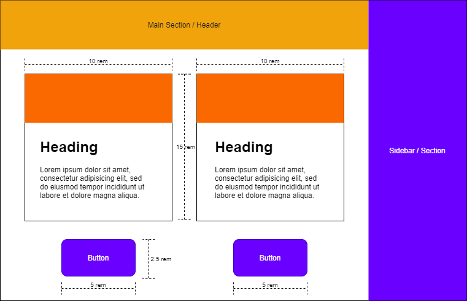

# Responsive Sizing Using `rem`

> Created by [@aashwath](https://github.com/aashwath)

---

[Live Demo](https://codepen.io/aashwath/pen/ZEWWwKw)

## Value of `rem`

The value of the CSS unit `rem` is equivalent to the font size of the root `html` element.

```css
html {
  font-size: 16px; /* means 1rem = 16px */
}
```

* Browsers use this method to default the value of `1rem` to `16px`.
* This can be leveraged by developers to change [box-model](https://developer.mozilla.org/en-US/docs/Learn/CSS/Building_blocks/The_box_model) properties of an element such as:
  1. Height
  2. Width
  3. Margin
  4. Padding.., and reduce the dependencies on media queries.

---

## Implementation

The value of `rem` can be changed for different viewports.

```css
/* for extra small devices */
html {
  font-size: 4px; /* means 1rem = 4px */
}

/* Small devices (landscape phones, 576px and up) */
@media (min-width: 576px) {
  html {
    font-size: 8px; /* means 1rem = 8px */
  }
}

/* Medium devices (tablets, 768px and up) */
@media (min-width: 768px) {
    html {
    font-size: 10px; /* means 1rem = 10px */
  }
}

/* Large devices (desktops, 992px and up) */
@media (min-width: 992px) {
  html {
    font-size: 12px; /* means 1rem = 12px */
  }
}
```

As per the code block, the following table can be concluded - 

| Viewport                  | Minimum width | `rem` value |
| ------------------------- | ------------- | ----------- |
| Desktop                   | `992px`       | `12px`      |
| Tablet                    | `768px`       | `10px`      |
| Landscape Oriented Phones | `576px`       | `8px`       |
| Portrait Oriented Phones  | `< 576px`     | `4px`       |

The `box-model` properties of UI elements can be provided with `rem` values to make their dimensions fully responsive

---

## Example

Consider a webpage that has a sidebar to the right and the main section to the left. The main section has a top nav, a few cards and buttons.



For a responsive website, say the larger layout (main and sidebar sections) are configured using CSS flexbox or CSS grid. These will respond and resize when the viewport size changes. But developers often find themselves writing lots of media queries to target and resize elements such as cards and buttons for example.

Instead, with this method, we have configured the value of rem to change as per the viewport. So, the height and width of the cards and the buttons will resize automatically as below:


| Element | Property | Value in `rem` | `XS` Viewport | `SM` Viewport | `MD` Viewport | `LG` Viewport |
| ------- | -------- | -------------- | ------------- | ------------- | ------------- | ------------- |
|         |          |                | `1rem` = 4px  | `1rem` = 8px  | `1rem` = 10px | `1rem` = 12px |
| Card    | Height   | `15rem`        | `60px`        | `120px`       | `150px`       | `180px`       |
| Card    | Width    | `10rem`        | `40px`        | `80px`        | `100px`       | `120px`       |
| Button  | Height   | `2.5rem`       | `10px`        | `20px`        | `25px`        | `30px`        |
| Button  | Width    | `5rem`         | `20px`        | `40px`        | `50px`        | `60px`        |

---

## Conclusion

By anchoring the media queries around the unit `rem` (as shown in [here](#implementation)), the developers can avoid media queries for `box-model` viz `height`, `width`, `padding`, `margin`. This can also be used for [positioning `absolute` elements](https://developer.mozilla.org/en-US/docs/Learn/CSS/CSS_layout/Positioning).

---

## References and Links

1. [Interactive demo on CodePen](https://codepen.io/aashwath/pen/ZEWWwKw)
2. [More about CSS units](https://developer.mozilla.org/en-US/docs/Learn/CSS/Building_blocks/Values_and_units)
